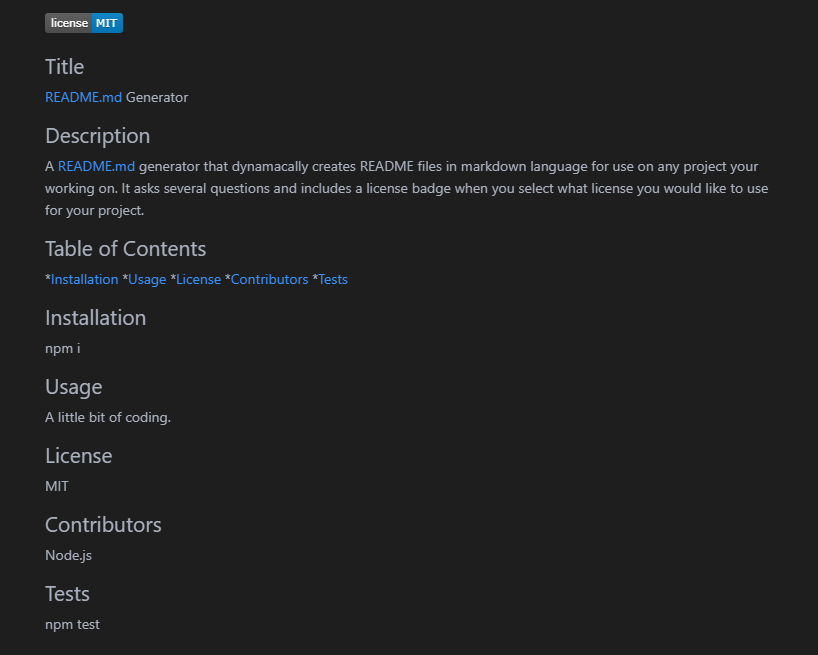

   
## Title 

README.md Generator

## Description

A README.md generator that dynamacally creates README files in markdown language for use on any project your working on.
It asks several questions and includes a license badge when you select what license you would like to use for your project.

[Sample README.md](assets/sampleREADME.md)

## YouTube Demo

https://www.youtube.com/watch?v=rAbHrIhFHxs&feature=youtu.be

## Table of Contents

   *[Installation](#Installation)
   *[Usage](#Usage)
   *[License](#License)
   *[Contributors](#Contributors)
   *[Tests](#Tests)

## Installation

npm i

## Usage

A little bit of coding in Node.js required :-)

## License

MIT
    

## Contributors

## Tests

npm test

## Screen Shot

 